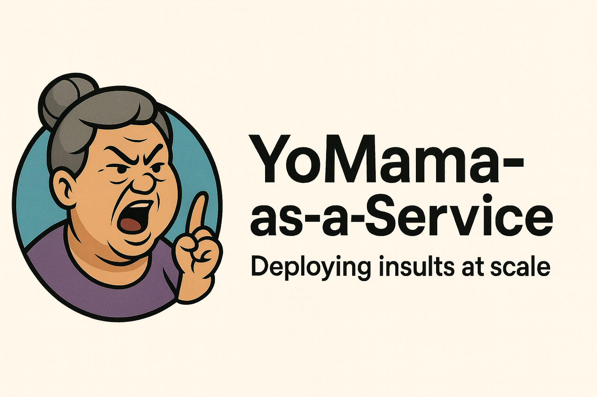

# 🎤 YoMama-as-a-Service



## *Deploying Insults at Scale* 🚀

An AI-powered Yo Mama joke generator that crafts customized roasts using Google Gemini. Because your infrastructure isn't the only thing that needs load balancing—your insults do too. Generate jokes in various flavors (cybersecurity, tech, Linux, gaming, etc.) with adjustable meanness and nerdiness levels.

**Now with 99.9% uptime for maximum disrespect!**

**Primary Platforms: Discord & Matrix bots with full command support!**

## ✨ Features (aka The Roast Stack)

- 🎯 **Multiple Flavors**: Classic (traditional Yo Mama jokes), cybersecurity, tech, Linux, gaming, programming, networking, cloud, DevOps, database, and more—because microservices should apply to insults too
- 🔥 **Adjustable Meanness**: Scale from 1 (gentle) to 10 (absolutely savage)—like severity levels, but for emotional damage
- 🤓 **Nerdiness Control**: Scale from 1 (accessible to everyone) to 10 (extremely technical)—choose your own adventure in technical debt
- � **Docker Support**: Multi-stage builds with automatic OS updates—containerized roasting for the cloud-native era
- �🔒 **Enterprise-Grade Secrets Management**: Doppler, AWS Secrets Manager, HashiCorp Vault, or .env—because even your API keys deserve better than yo mama's password: "password123"
- 🤖 **Google Gemini AI**: Powered by Gemini 2.5 Flash-Lite (configurable)—faster than yo mama trying to close all her browser tabs
- 💬 **Discord Bot**: Full slash commands and text commands support—now with less latency than yo mama's reaction time
- 🔷 **Matrix Bot**: Federated roasting across the Matrix network—because centralized burns are so 2010
- 📦 **Batch Generation**: Generate multiple jokes at once—horizontal scaling for maximum psychological impact
- 🎲 **Random Mode**: Completely random jokes with random parameters—chaos engineering for comedy
- 💻 **CLI Mode**: Interactive terminal interface—for when you need to roast in production without a GUI

## 📋 Requirements (Dependencies for Destruction)

- **For Docker**: Docker 20.10+ and Docker Compose 2.0+ (the professional way)
- **For Local**: Python 3.10+ (older versions are slower than yo mama climbing stairs)
- Google Gemini API key ([Get one here](https://makersuite.google.com/app/apikey))—free tier included, unlike yo mama's medical bills
- Optional: Doppler account for secrets management (recommended for environments where yo mama can't peek at your .env file)

## 🚀 Quick Start

### Option 1: Docker (Recommended for Production) 🐳

```bash
# Build and run with Docker
./docker-build.sh
docker-compose up -d

# View logs
docker-compose logs -f
```

See [DOCKER.md](DOCKER.md) for complete Docker documentation.

### Option 2: Local Installation

#### 1. Install Dependencies

```bash
pip install -r requirements.txt
```

#### 2. Configure Secrets

#### Option A: Using .env file (Simple)

```bash
cp .env.example .env
# Edit .env and add your GEMINI_API_KEY
```

#### Option B: Using Doppler (Recommended for Production)

```bash
# Install Doppler CLI
brew install dopplersdk/tap/doppler  # or your preferred method

# Setup Doppler
doppler login
doppler setup

# Add your secrets
doppler secrets set GEMINI_API_KEY="your_key_here"
```

### 3. Run the Bot

```bash
# Run as Discord bot
python main.py --discord

# Run as Matrix bot
python main.py --matrix

# CLI Interactive mode
python main.py

# Generate a single joke (CLI)
python main.py -f cybersecurity -m 8 -n 9

# Generate 5 jokes (CLI)
python main.py -b 5 -f linux

# Random joke (CLI)
python main.py -r

# List available flavors
python main.py --flavors
```

## 📖 Usage Examples

### Discord Bot

Run the bot:
```bash
python main.py --discord
```

**Slash Commands:**
- `/joke [flavor] [meanness] [nerdiness] [target]` - Generate a joke
- `/random` - Generate a random joke
- `/batch [count] [flavor] [meanness] [nerdiness]` - Generate multiple jokes
- `/flavors` - List available flavors

**Text Commands:**
- `!joke [flavor] [meanness] [nerdiness]` - Generate a joke
- `!random` - Generate a random joke
- `!flavors` - List available flavors

### Matrix Bot

Run the bot:
```bash
python main.py --matrix
```

**Commands:**
- `!joke [flavor] [meanness] [nerdiness]` - Generate a joke
- `!random` - Generate a random joke
- `!batch [count] [flavor]` - Generate multiple jokes
- `!flavors` - List available flavors
- `!help` - Show help message

The bot will auto-join rooms when invited (configurable).

### Command Line Mode

```bash
# Generate a harsh, nerdy cybersecurity joke
python main.py -f cybersecurity -m 8 -n 9

# Generate a gentle, accessible tech joke
python main.py -f tech -m 2 -n 3

# Generate 5 Linux-themed jokes
python main.py -b 5 -f linux -m 6 -n 8

# Use a custom target name
python main.py -f gaming -t "your code" -m 7

# Random joke with random parameters
python main.py -r
```

### Interactive Mode

```bash
python main.py -i
```

Interactive commands:
- `[Enter]` - Generate joke with current settings
- `f [flavor]` - Change flavor (e.g., `f cybersecurity`)
- `m [1-10]` - Change meanness level (e.g., `m 8`)
- `n [1-10]` - Change nerdiness level (e.g., `n 9`)
- `t [name]` - Change target name (e.g., `t your server`)
- `b [count]` - Generate batch of jokes (e.g., `b 5`)
- `r` - Generate random joke
- `flavors` - List available flavors
- `settings` - Show current settings
- `quit` - Exit

### Python API

```python
from yo_mama_generator import YoMamaGenerator
from config import get_config

# Initialize
config = get_config()
generator = YoMamaGenerator(
    api_key=config.gemini_api_key,
    model_name=config.gemini_model
)

# Generate a single joke
joke = generator.generate_joke(
    flavor='cybersecurity',
    meanness=8,
    nerdiness=9
)
print(joke)

# Generate batch
jokes = generator.generate_batch(
    count=5,
    flavor='linux',
    meanness=6,
    nerdiness=8
)
for joke in jokes:
    print(joke)

# Random joke
random_joke = generator.random_joke()
print(random_joke)

# List available flavors
flavors = YoMamaGenerator.list_flavors()
print(flavors)
```

## 🎨 Available Flavors

- `classic` - **Traditional Yo Mama jokes!** Classic formats like "so fat", "so ugly", "so old" - timeless, non-technical humor
- `cybersecurity` - Hacking, vulnerabilities, security tools (CrowdStrike, Shodan, etc.)
- `tech` - General technology, computers, software, hardware
- `linux` - Linux, Unix, command line, distros, system administration
- `general` - Everyday technology, smartphones, internet
- `gaming` - Video games, gaming hardware, esports, streaming
- `programming` - Coding, programming languages, APIs, debugging
- `networking` - Networks, routers, protocols, TCP/IP, DNS
- `cloud` - Cloud computing, AWS, Azure, containers, Kubernetes
- `devops` - DevOps, CI/CD, Docker, automation, monitoring
- `database` - Databases, SQL, NoSQL, queries, optimization

## 🎚️ Meanness Scale (The Severity Matrix)

- **1-2**: Extremely gentle, wholesome, just playful teasing—like a health check that always returns 200 OK
- **3-4**: Light roasting with a slight edge—WARNING level logs
- **5-6**: Moderate roasting, noticeable but not harsh—ERROR level, but still recoverable
- **7-8**: Harsh and brutal, no holding back—CRITICAL alerts going off
- **9-10**: Absolutely merciless, nuclear-level savage—rm -rf / with sudo privileges

## 🤓 Nerdiness Scale (The Stack Depth)

- **1-2**: Basic everyday terms anyone would understand—even yo mama's browser history is more technical
- **3-4**: Simple tech terms most people know—"Have you tried turning it off and on again?"
- **5-6**: Technical jargon that tech-savvy people know—Stack Overflow regular territory
- **7-8**: Advanced technical concepts and insider references—reading RFCs for fun
- **9-10**: Extremely obscure technical knowledge only experts get—you understand the Linux kernel better than social cues

## 🔒 Configuration

The bot uses a comprehensive priority system for secrets:

1. **Doppler Secrets Manager** (if `DOPPLER_TOKEN` is set) - HIGHEST PRIORITY
2. **AWS Secrets Manager** (if `SECRETS_MANAGER=aws`)
3. **HashiCorp Vault** (if `SECRETS_MANAGER=vault`)
4. **Environment variables** from `.env` file - FALLBACK
5. **Default values** - LAST RESORT

**📖 See [SECRETS_MANAGEMENT.md](SECRETS_MANAGEMENT.md) for detailed setup guides for each secrets manager.**

### Environment Variables

**Core Configuration:**

| Variable | Description | Default | Required |
|----------|-------------|---------|----------|
| `GEMINI_API_KEY` | Google Gemini API key | - | ✅ Yes |
| `GEMINI_MODEL` | Gemini model name | `gemini-2.5-flash-lite` | No |
| `DEFAULT_FLAVOR` | Default joke flavor | `tech` | No |
| `DEFAULT_MEANNESS` | Default meanness (1-10) | `5` | No |
| `DEFAULT_NERDINESS` | Default nerdiness (1-10) | `5` | No |
| `LOG_LEVEL` | Logging level | `INFO` | No |
| `DOPPLER_TOKEN` | Doppler service token | - | No |
| `DOPPLER_PROJECT` | Doppler project name | `yo-mama-bot` | No |
| `DOPPLER_CONFIG` | Doppler config/env | `dev` | No |

**Discord Bot:**

| Variable | Description | Required |
|----------|-------------|----------|
| `DISCORD_BOT_TOKEN` | Bot token from Discord Developer Portal | ✅ Yes |
| `DISCORD_PREFIX` | Text command prefix | No (default: `!`) |
| `DISCORD_WEBHOOK_URL` | Optional webhook URL | No |

**Matrix Bot:**

| Variable | Description | Required |
|----------|-------------|----------|
| `MATRIX_HOMESERVER` | Matrix homeserver URL | ✅ Yes |
| `MATRIX_USER_ID` | Bot user ID (e.g., @bot:matrix.org) | ✅ Yes |
| `MATRIX_ACCESS_TOKEN` | Bot access token | ✅ Yes |
| `MATRIX_DEVICE_ID` | Device ID | No |
| `MATRIX_PREFIX` | Command prefix | No (default: `!`) |
| `MATRIX_AUTO_JOIN` | Auto-join invited rooms | No (default: true) |

## 📦 Project Structure

```
Yo_Mama/
├── main.py                        # Main entry point (CLI/Discord/Matrix)
├── demo.py                        # API usage demonstrations
├── test_setup.py                  # Configuration test script
├── requirements.txt               # Python dependencies
├── .env.example                   # Example configuration
├── setup.sh                       # Automated setup
├── run.sh                         # Quick run script
├── README.md                      # This file
├── QUICKSTART.md                  # Quick reference
└── yo_mama/                       # Main package
    ├── __init__.py
    ├── config.py                  # Configuration management
    ├── yo_mama_generator.py       # Joke generator core
    └── platforms/                 # Platform integrations
        ├── __init__.py
        ├── discord_bot.py         # Discord bot
        └── matrix_bot.py          # Matrix bot
```

## 🎯 Example Jokes (Production-Ready Roasts)

Here are some examples of what the bot deploys:

**Cybersecurity (Meanness: 8, Nerdiness: 9)**
> Yo mama so insecure, even CrowdStrike put her in Reduced Functionality Mode.

**Tech (Meanness: 5, Nerdiness: 6)**
> Yo mama so slow, when she tried to catch up on her emails, Outlook timed her out.

**Linux (Meanness: 6, Nerdiness: 8)**
> Yo mama so bloated, even `apt-get autoremove` couldn't clean her up.

**Classic (Meanness: 8, Nerdiness: 1)**
> Yo mama so fat, when she sits around the house, she sits AROUND the house.

**General (Meanness: 3, Nerdiness: 2)**
> Yo mama so forgetful, she tried to reboot the router by blowing on it like a Nintendo 64 cartridge.

*Note: All jokes are AI-generated and deployed with zero downtime.*

## 🛠️ Development

### Running Tests

```bash
# Test configuration
python -c "from config import get_config; c = get_config(); print(c.validate())"

# Test joke generation
python main.py -f tech -m 5 -n 5
```

### Changing the AI Model

You can use any Google Gemini model:

```bash
# In .env or Doppler
GEMINI_MODEL=gemini-2.5-flash-lite                # Default (ultra fast, cost-efficient)
GEMINI_MODEL=gemini-2.5-flash                     # Gemini 2.5 Flash (balanced)
GEMINI_MODEL=gemini-2.5-pro                       # Gemini 2.5 Pro (advanced thinking)
GEMINI_MODEL=gemini-2.0-flash                     # Gemini 2.0 Flash
GEMINI_MODEL=gemini-1.5-pro                       # Gemini 1.5 Pro
```

## 🤖 Platform Setup

### Discord Bot Setup

1. Go to [Discord Developer Portal](https://discord.com/developers/applications)
2. Create a new application
3. Go to "Bot" section and create a bot
4. Copy the bot token to your `.env` file as `DISCORD_BOT_TOKEN`
5. Enable these intents: Message Content, Server Members, Presence
6. Go to OAuth2 → URL Generator
7. Select scopes: `bot`, `applications.commands`
8. Select bot permissions: Send Messages, Read Messages, Use Slash Commands
9. Use the generated URL to invite the bot to your server
10. Run: `python main.py --discord`

### Matrix Bot Setup

1. Create a Matrix account for your bot (or use existing)
2. Get your access token:
   - Element Web: Settings → Help & About → Access Token
   - Or use the login API
3. Add credentials to `.env`:
   ```
   MATRIX_HOMESERVER=https://matrix.org
   MATRIX_USER_ID=@yourbot:matrix.org
   MATRIX_ACCESS_TOKEN=your_access_token_here
   ```
4. Run: `python main.py --matrix`
5. Invite the bot to a room - it will auto-join!

## 🔮 Future Enhancements (The Roadmap to Roastopia)

- [x] Discord bot with slash commands—✅ Shipped
- [x] Matrix bot with room support—✅ Federated and ready
- [x] Rate limit handling with Yo Mama-style error messages—✅ Even errors are funny now
- [ ] Bluesky integration—decentralized disrespect
- [ ] Mastodon integration—federated flame-throwing
- [ ] Web API with FastAPI—RESTful roasting as a service
- [ ] Custom joke templates—bring your own burns
- [ ] Joke rating and feedback system—A/B testing for maximum damage
- [ ] Multi-language support—insults without borders
- [ ] Scheduled joke posting—cron jobs for comedy
- [ ] Joke history and favorites—because some burns deserve to be immortalized
- [ ] Prometheus metrics—track your insult deployment rate
- [ ] Grafana dashboards—visualize the emotional damage in real-time

## 📄 License

This project is licensed under the Mozilla Public License Version 2.0 (MPL-2.0).
You may use, modify, and distribute the code under the terms of that license.

See the full license text in the `LICENSE` file included with this repository.

## 🤝 Contributing

Contributions welcome! Feel free to:
- Add new joke flavors
- Improve joke quality
- Add platform integrations
- Fix bugs
- Improve documentation

## ⚠️ Disclaimer (The Fine Print)

This bot generates jokes and roasts that can be mean or offensive. Use responsibly and be mindful of your audience. The jokes are AI-generated and meant for entertainment purposes only.

**Warning**: May cause emotional damage, hurt feelings, and uncontrollable laughter. Not responsible for:
- Broken friendships
- HR complaints
- Getting kicked from Discord servers
- Your homeserver admin banning the bot
- Yo mama finding out and grounding you

Side effects may include: increased sass, improved roasting skills, and an uncontrollable urge to `git push --force` your insults to production.

**Use in production at your own risk.** We recommend extensive testing in staging environments (aka your friend group) first.

---

## 💬 Community & Support

### Get Involved

- **⭐ Star the repo** - Show your support for AI-powered roasting!
- **📢 Share** - Tell other Discord/Matrix communities about YoMama-as-a-Service
- **🐛 Report bugs** - Help us improve joke quality and reliability
- **💡 Request features** - Share your ideas for new flavors or platforms
- **🔧 Contribute** - Submit pull requests with new joke styles
- **� Improve docs** - Help others deploy insults at scale

### Community Channels

- **[GitHub Discussions](https://github.com/ChiefGyk3D/Yo_Mama/discussions)** - Ask questions, share your best roasts
- **[GitHub Issues](https://github.com/ChiefGyk3D/Yo_Mama/issues)** - Bug reports and feature requests
- **[Pull Requests](https://github.com/ChiefGyk3D/Yo_Mama/pulls)** - Contribute code and improvements

### Stay Updated

- **Watch releases** - Get notified of new joke flavors and features
- **Follow development** - Track progress on roadmap items
- **Join discussions** - Participate in roast engineering planning

---

## 💝 Donations and Tips

If you find YoMama-as-a-Service useful (or hilarious), consider supporting development:

**Donate**:

<div align="center">
  <table>
    <tr>
      <td align="center"><a href="https://patreon.com/chiefgyk3d?utm_medium=unknown&utm_source=join_link&utm_campaign=creatorshare_creator&utm_content=copyLink" title="Patreon"></a></td>
      <td align="center"><a href="https://streamelements.com/chiefgyk3d/tip" title="StreamElements"></a></td>
    </tr>
    <tr>
      <td align="center">Patreon</td>
      <td align="center">StreamElements</td>
    </tr>
  </table>
</div>

### Cryptocurrency Tips

<div align="center">
  <table style="border:none;">
    <tr>
      <td align="center" style="padding:8px; min-width:120px;">
        
      </td>
      <td align="left" style="padding:8px;">
        <b>Bitcoin</b><br/>
        <code style="font-size:12px;">bc1qztdzcy2wyavj2tsuandu4p0tcklzttvdnzalla</code>
      </td>
    </tr>
    <tr>
      <td align="center" style="padding:8px; min-width:120px;">
        
      </td>
      <td align="left" style="padding:8px;">
        <b>Monero</b><br/>
        <code style="font-size:12px;">84Y34QubRwQYK2HNviezeH9r6aRcPvgWmKtDkN3EwiuVbp6sNLhm9ffRgs6BA9X1n9jY7wEN16ZEpiEngZbecXseUrW8SeQ</code>
      </td>
    </tr>
    <tr>
      <td align="center" style="padding:8px; min-width:120px;">
        
      </td>
      <td align="left" style="padding:8px;">
        <b>Ethereum</b><br/>
        <code style="font-size:12px;">0x554f18cfB684889c3A60219BDBE7b050C39335ED</code>
      </td>
    </tr>
  </table>
</div>

---

<div align="center">

**Made with �🔥 and AI** | *Deploying Insults at Scale Since 2025*

Powered by Google Gemini | Created by [ChiefGyk3D](https://github.com/ChiefGyk3D)

## Author & Socials

<table>
  <tr>
    <td align="center"><a href="https://social.chiefgyk3d.com/@chiefgyk3d" title="Mastodon"></a></td>
    <td align="center"><a href="https://bsky.app/profile/chiefgyk3d.com" title="Bluesky"></a></td>
    <td align="center"><a href="http://twitch.tv/chiefgyk3d" title="Twitch"></a></td>
    <td align="center"><a href="https://www.youtube.com/channel/UCvFY4KyqVBuYd7JAl3NRyiQ" title="YouTube"></a></td>
    <td align="center"><a href="https://kick.com/chiefgyk3d" title="Kick"></a></td>
    <td align="center"><a href="https://www.tiktok.com/@chiefgyk3d" title="TikTok"></a></td>
    <td align="center"><a href="https://discord.chiefgyk3d.com" title="Discord"></a></td>
    <td align="center"><a href="https://matrix-invite.chiefgyk3d.com" title="Matrix"></a></td>
  </tr>
  <tr>
    <td align="center">Mastodon</td>
    <td align="center">Bluesky</td>
    <td align="center">Twitch</td>
    <td align="center">YouTube</td>
    <td align="center">Kick</td>
    <td align="center">TikTok</td>
    <td align="center">Discord</td>
    <td align="center">Matrix</td>
  </tr>
</table>

</div>
